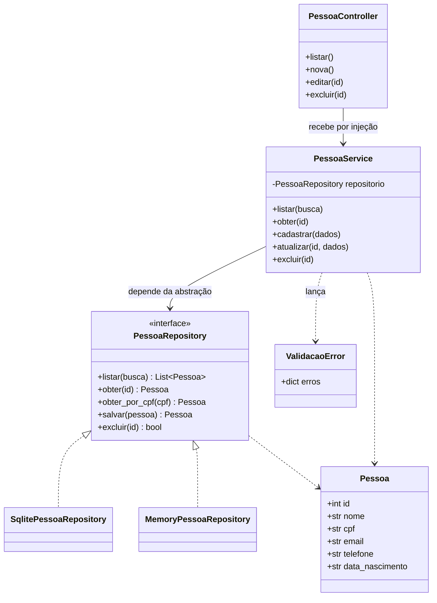
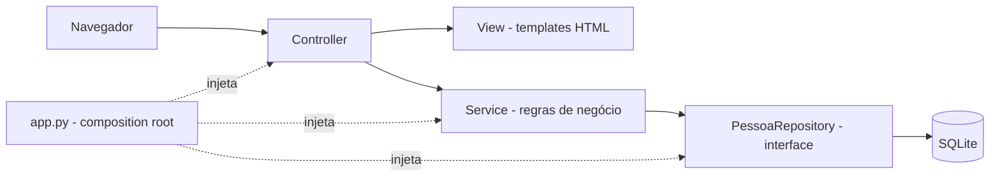
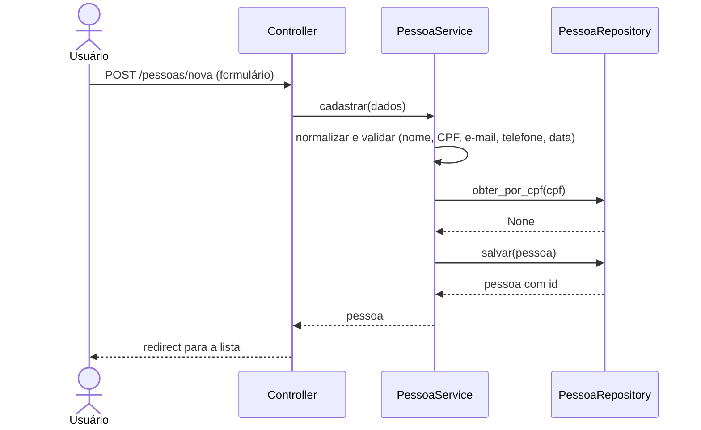
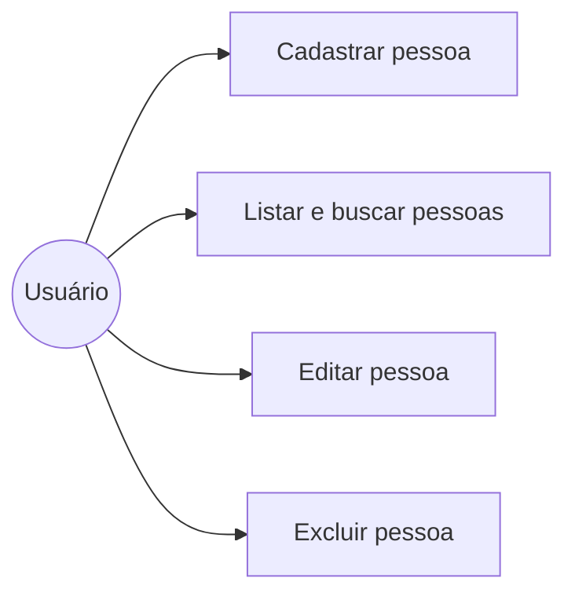

# Diagramas da solução

## Diagrama de classes

```mermaid
classDiagram
    class Pessoa {
        +int id
        +str nome
        +str cpf
        +str email
        +str telefone
        +str data_nascimento
    }
    class PessoaRepository {
        <<interface>>
        +listar(busca) List~Pessoa~
        +obter(id) Pessoa
        +obter_por_cpf(cpf) Pessoa
        +salvar(pessoa) Pessoa
        +excluir(id) bool
    }
    class SqlitePessoaRepository
    class MemoryPessoaRepository
    class PessoaService {
        -PessoaRepository repositorio
        +listar(busca)
        +obter(id)
        +cadastrar(dados)
        +atualizar(id, dados)
        +excluir(id)
    }
    class PessoaController {
        +listar()
        +nova()
        +editar(id)
        +excluir(id)
    }
    class ValidacaoError {
        +dict erros
    }
    PessoaRepository <|.. SqlitePessoaRepository
    PessoaRepository <|.. MemoryPessoaRepository
    PessoaService --> PessoaRepository : depende da abstração
    PessoaService ..> ValidacaoError : lança
    PessoaController --> PessoaService : recebe por injeção
    PessoaRepository ..> Pessoa
    PessoaService ..> Pessoa
```

## Camadas (MVC + Repository)

```mermaid
flowchart LR
    U[Navegador] --> C[Controller]
    C --> V[View - templates HTML]
    C --> S[Service - regras de negócio]
    S --> R[PessoaRepository - interface]
    R --> D[(SQLite)]
    A[app.py - composition root] -. injeta .-> C
    A -. injeta .-> S
    A -. injeta .-> R
```

## Sequência: cadastrar pessoa

```mermaid
sequenceDiagram
    actor U as Usuário
    participant C as Controller
    participant S as PessoaService
    participant R as PessoaRepository
    U->>C: POST /pessoas/nova (formulário)
    C->>S: cadastrar(dados)
    S->>S: normalizar e validar (nome, CPF, e-mail, telefone, data)
    S->>R: obter_por_cpf(cpf)
    R-->>S: None
    S->>R: salvar(pessoa)
    R-->>S: pessoa com id
    S-->>C: pessoa
    C-->>U: redirect para a lista
```

## Caso de uso

```mermaid
flowchart LR
    U((Usuário)) --> UC1[Cadastrar pessoa]
    U --> UC2[Listar e buscar pessoas]
    U --> UC3[Editar pessoa]
    U --> UC4[Excluir pessoa]
```
